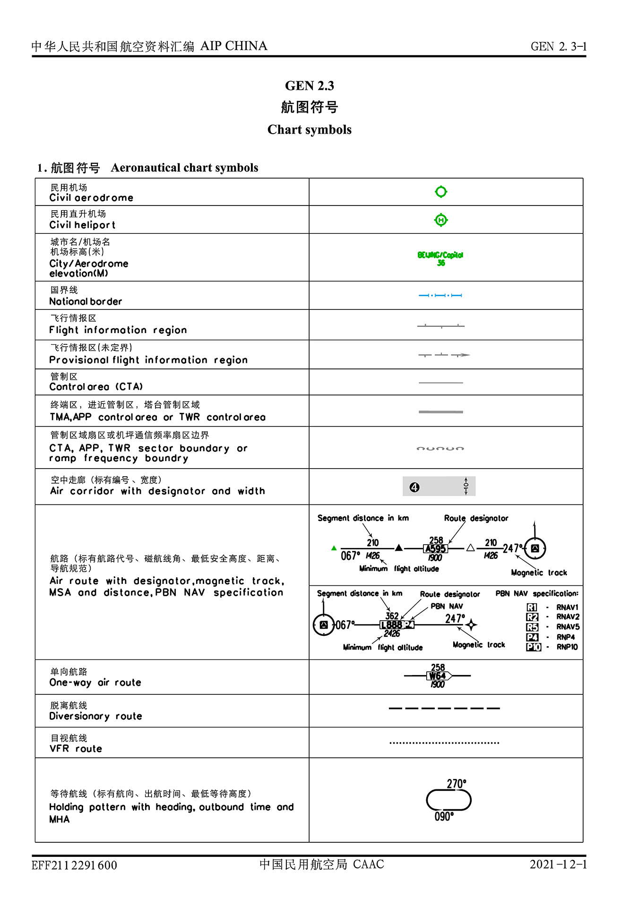
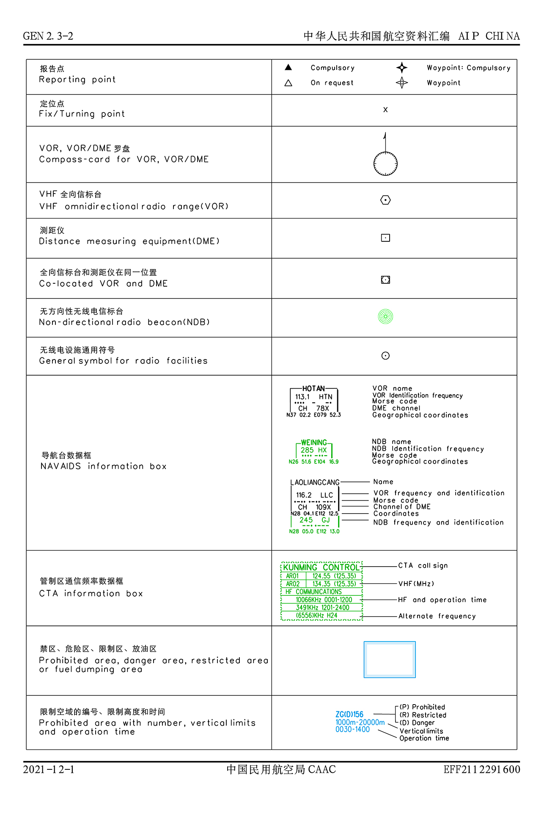
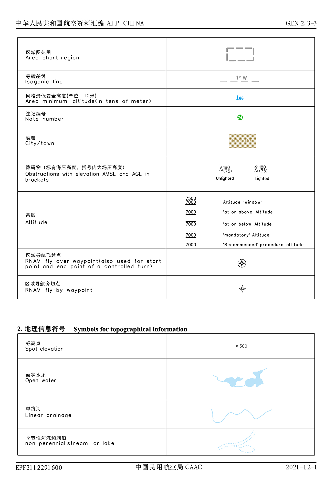
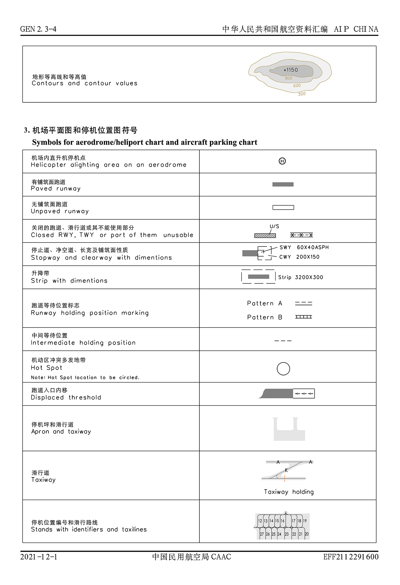
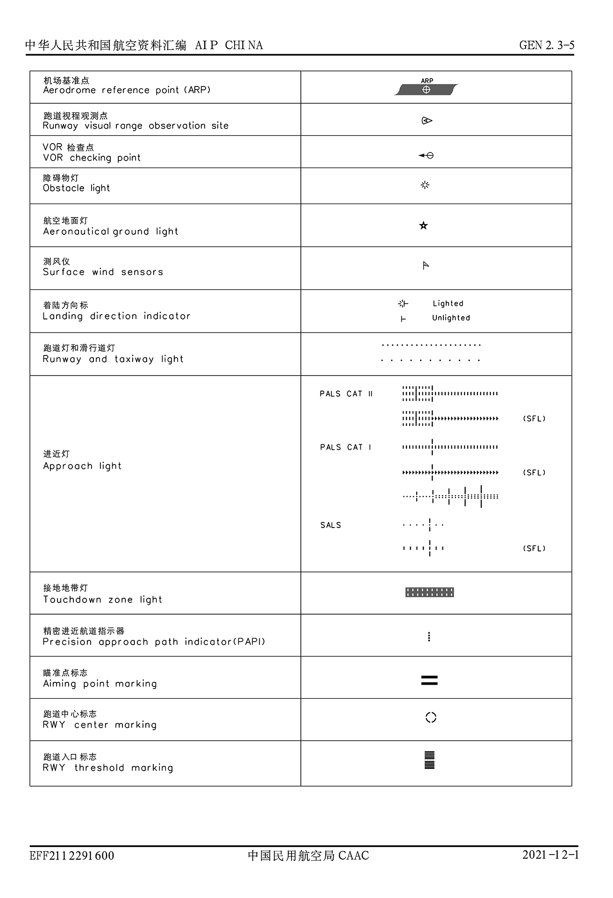
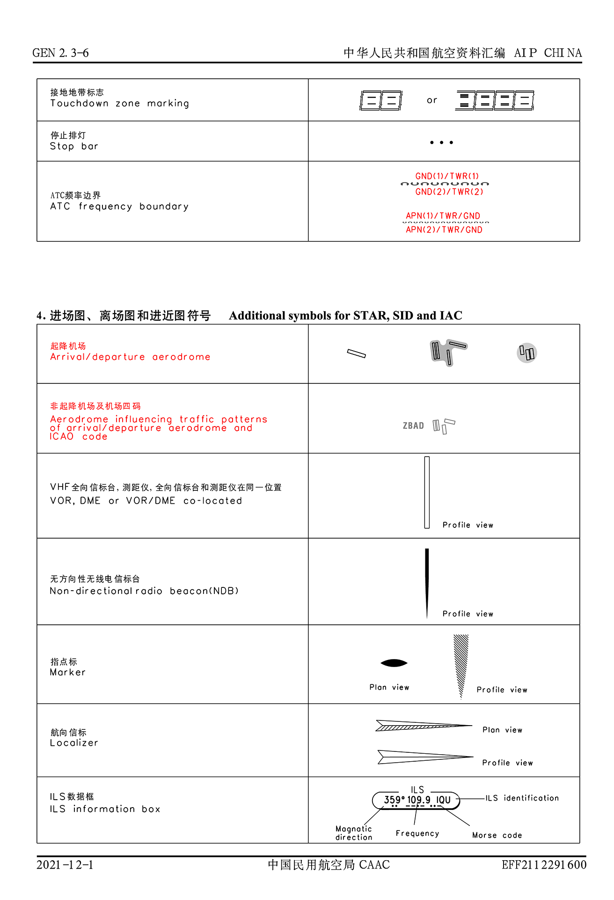

# 如何使用 P3D 连飞

欢迎您阅读本教程。

本教程旨在帮助您更好地使用 P3D 在 VATSIM 进行连飞，提升您的连飞体验，享受连飞带来的乐趣。

## 目录

1. [连飞软件](#连飞软件)
   - [下载](#下载)
   - [安装](#安装)
   - [设置](#设置)
   - [使用](#使用)
2. [映射插件](#映射插件)
   - [简介](#简介)
   - [下载](#下载-1)
   - [安装](#安装-1)
   - [设置](#设置-1)
3. [机模插件](#机模插件)
4. [地景插件](#地景插件)
5. [天气插件](#天气插件)
6. [后推插件](#后推插件)

## 连飞软件

vPilot 是一个用于将 FSX, P3D 或 MSFS 连接到 VATSIM 连飞网络的一个免费软件。

本教程只介绍了 vPilot 的基本操作。您可以通过阅读 [vPilot 官方文档](https://vpilot.rosscarlson.dev/Documentation)或[本 wiki 中的 vPilot 官方文档翻译](./vPilot%20使用文档.md)以获取更详细的信息。

### 下载

进入[官网下载页面](https://vpilot.rosscarlson.dev/Download)，点击 `Download Stable` 按钮即可下载最新版本的 vPilot 客户端安装包。

### 安装

1. 安装包下载完成后，双击运行安装文件打开安装程序。
2. 进入软件使用条款界面。如果您同意其条款，点击右下角 `I Agree` 按钮以继续。
3. 进入安装组件选择界面。您可以按需选择您想安装的组件，之后点击右下角 `Next` 按钮以继续。
4. 进入安装目录选择界面。您可以选择您想将软件安装到的文件夹，之后右下角点击 `Install` 按钮以开始安装。
5. 软件安装中，请耐心等待。
6. 安装完毕，点击右下角 `Finish` 按钮以完成安装。

至此，您已成功在您的计算机上安装 vPilot 软件。

### 设置

您可以查阅[本 wiki 中的 vPilot 官方文档翻译](./vPilot%20使用文档.md#配置)获取详细的配置教程。

### 使用

您可以查阅[本 wiki 中的 vPilot 官方文档翻译](./vPilot%20使用文档.md)相关部分以获取详细的使用教程。

## 映射插件

不知您在连飞时有没有困惑过：为什么其他机组在您的模拟器中不是 CRJ 700 就是 Airbus 321？其实这就说明您的模拟器中并未安装或缺失部分映射机模包。

与用于 X-Plane 平台连飞的 xPilot 软件不同的是，vPilot 软件并没有自带映射机模包，所以您需要手动安装映射机模插件。在此，我们推荐您使用 Alpha India Group 出品的 AI Manager 进行映射机模的下载与安装。

### 简介

AI Manager 是一个目前市面上相对较为优秀的游戏内 AI 交通安装和管理插件，支持 FSX, P3D 和 MSFS，适配众多免费和收费的 AI 机模，并能够自动从各大涂装网站下载安装涂装，还有众多功能等待您去探索。

AI Manager 内置了 One Click Installer (OCI)，一个让您只需点几下鼠标即可轻松安装一个航空公司的 AI 交通（包括飞机模型、涂装、飞行计划等）的傻瓜式安装程序。OCI 允许用户选择安装在本地的航空公司，也会定期更新模型、涂装以及 AI 航班飞行计划以为您带来更好的体验。
 
### 下载

进入[官网下载页面](https://www.alpha-india.net/ai-manager/)，找到 `Downloads` 区域，点击您想下载的版本即可下载 AI Manager。

### 安装

解压下载完成的压缩包到合适的位置即可。

### 设置

本文档中的设置教程较为简略，您可以自行从其他渠道获取更详细的 AI Manager 设置和使用教程。

1. **（如您已拥有 AVSIM Library 账号请略过此步骤）**
前往 [AVSIM Library](https://library.avsim.net/register.php) 注册账号。
2. 将 `AIGTech - AI Manager.exe` 设置为以管理员身份运行以便使用。 
3. 双击运行 `AIGTech - AI Manager.exe`，软件初始化速度较慢，请耐性等待。
4. 软件启动后点击界面左侧 `Settings` 按钮，此时AIM处于 `Flight Simulator` 页面。
AIM 会自动识别您已安装的飞行模拟器版本和文件夹位置，不过仍建议您自行检查相关信息是否正确。 
5. 点击上方的 `Cookies` 按钮。如果您想让 AI Manager 能够自动下载各航空公司的涂装，您需要点击 `Login` 按钮登录您的 AVSIM Library 账号。
在登陆页面打开的过程中，您可能会收到一系列询问您是否运行页面脚本的弹窗，您都需要点击 `是` 按钮以确保登陆成功。登录成功后，您应该能如图所示看到 `Status: LOGGED IN`。点击右上角 `Save` 按钮进行保存。
6. 点击上方 `AIGAIM - OCI` 按钮。点击 `Setup` 按钮选择您喜欢的且**剩余可用磁盘空间较为充足**的位置，您会看到 AIM 自动创建了一个新的子文件夹在您选择的位置下。该文件夹就是以后 AIM 下载和安装映射机模、涂装等文件的地方。如您只计划使用免费的映射机模与涂装，您还可以勾选 `Use Freeware only` 。点击右上角 `Save` 按钮进行保存。 

至此，您完成了 AI Manager 的简单设置。接下来是 AI 交通的简单下载安装教程。

1. 点击左侧 `Flightplans` 按钮，再点击上部 `Online` 按钮。此处就是 AIM 按航空公司所提供的飞行计划。在下载的飞行计划的过程中，AIM 也会自动下载和安装对应航空公司的机模与涂装。
2. 找到您想安装的航空公司，依次点击 `Install` 、 `Install using OCI` 、 `Install`。
待 `Flightplan Installation` 窗口消失且您选择的航空公司从列表中消失，相关机模、该航空公司的涂装与飞行计划就已经安装好了。
3. 重复此操作直到您完成所有您需要的航空公司下载与安装。
4. 启动 vPilot，软件会自动读取您安装的 AI 机模与涂装并在您日后的飞行中按照模型匹配规则自动完成映射。
关于 vPilot 的映射设置，您可以移步查阅 [vPilot 官方文档](https://vpilot.rosscarlson.dev/Documentation)或[本 wiki 中的 vPilot 官方文档翻译](./vPilot%20使用文档.md)以获取更详细的信息。

## 机模

一款优秀的机模能够为您的模拟飞行之旅增添不少精彩。您完全可以按照您的情况与需求选择最适合您自己的机模进行飞行。不过在此，笔者还是根据自己浅薄的模飞经历，对一些机模商进行主观推荐，因为它们可能会给您带来更加真实、有深度的模拟飞行体验，也能让您能更好地执行管制员的指令。您可以从第三方插件商处获取这些机模。

- Airbus 空客
  - A320 家族：Flight Sim Labs, Aerosoft
  - A330 家族：Aerosoft
- Boeing 波音
  - B737 家族：iFly, PMDG
  - B747 家族：PMDG
  - B777 家族：PMDG

## 地景

地景是模拟飞行的基础之一，一般分为机场地景和城市地景两种类型。一个最新、细节丰富、位置正确的地景能够显著提升您的飞行体验，让您的模拟飞行更加贴近真实。

最新、位置正确对于连飞而言是最重要的。如果您的地景是过时的乃至是系统的默认机场，您可能会发现其他机组的位置会与您模拟器中的位置有亿点点偏差（此问题在上海浦东和部分相对较小的机场尤为严重）。这时由于地景的偏差，您可能无法完全正确地执行管制员的指令，这会让您的飞行体验有所折扣，也会给管制和其他机组带来一定的困扰。

为了让您拥有良好的飞行体验与活动体验，我们强烈建议您在开始飞行或参与连飞活动之前通过以下方式检查、获取并安装最新的活动机场地景：
- 从第三方插件商处购买。
- 从 [VATPRC 飞行员中心](https://pilot.vatprc.net/#/scenery)下载地景。
- 从其他渠道获取地景。

## 天气插件

连飞时，模拟器中的天气对于服务器和其他机组并没有直接影响，VATSIM 也并没有强制要求使用真实天气，您可以按照自己的喜好进行设置。但是由于 VATSIM 管制员都是按照真实时间和天气进行管制的，倘若您的天气不是实时的，可能会给您自己、其他机组以及管制员都带来一些麻烦。

天气会带来两个影响：高度和速度。

对于高度，游戏中默认天气的 QNH 值为 1013，而实时天气却并不是固定的值。倘若您模拟器中的 QNH 值与实时天气并不相同，您的飞行高度可能会与使用真实天气的管制员的指令高度有所区别，也会导致您与其他机组的垂直间隔不足安全距离，从而影响您和其他机组的飞行。

对于速度，首先您需要知道，在飞行中，您的相对地面的移动速度被称为地速，而飞机地速 GS = 飞机真空速 TAS + 飞机航迹顺风分量。倘若一群机组都使用实时天气的情况下，每个机组的地速差距应该都不大。而倘若这群机组中有一位飞行员没有使用实时天气，因为风的影响，可能会出现这位飞行员的飞行速度显著低于或高于其他机组的速度。这时，因为管制员只能按照真实天气对机组进行调速，则完全无法实现对机组间距的调整。这既会影响管制员的排序，也会影响您与其他机组的飞行。

为了减少不同的天气带来的飞行与沟通问题，我们建议您在连飞时使用实时天气插件以设置您模拟器中的天气状态为实时天气。

对于实时天气插件，笔者在此根据自己的使用经验主观推荐 HiFi Simulation Technologies 出品的 ActiveSky (ASP3D)，您可以从第三方插件商处购买获取此插件。当然，您完全可以自行从其他渠道获取其他实时天气插件。

## 后推插件

连飞时，您通常会需要将飞机从机位中推出。您使用的后推方式对于服务器和其他机组并没有直接影响，VATSIM 也并没有强制要求使用后推插件，P3D 自带的 `Shift` + `P` 的快捷键组合和一些机模自带的插件能够让您简单地实现后推的效果。但为了能够按照不同机场的实际运行情况进行后推，减少不必要的后推位置错误给您自己和其他机组、管制员带来的麻烦，我们建议您使用能够自定义后推路径的专业插件，按照机场地面的白色后推指引线对飞机进行后推。

对于后推插件，笔者目前知道能实现自定义后推路径的插件有两个，您可以从第三方插件商获取它们：

1. FSDreamTeam(FSDT) 开发的 GSX Ground Service (GSX)
2. FS2CREW 开发的 Ultimate Ground Crew X (UGCX)

您可以按照您自己的需求选择任何后推插件。后推插件不是使用 VATSIM 连飞时的必须插件。
